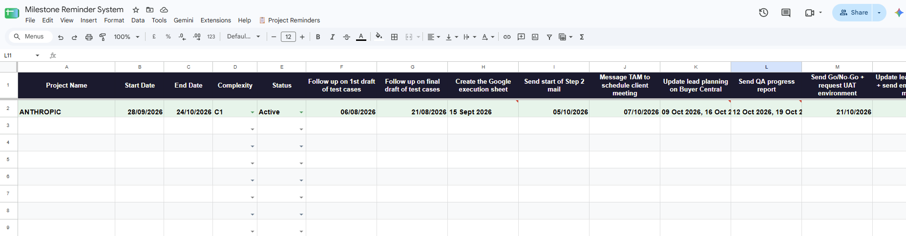
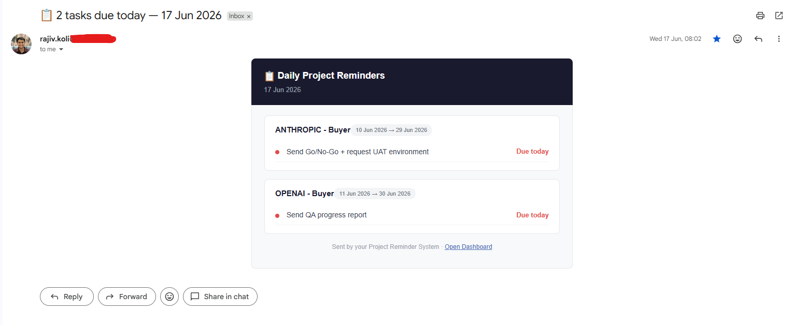
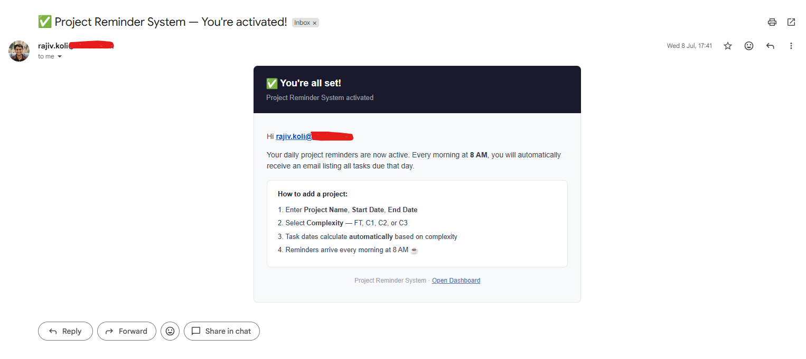

# 📋 Milestone Reminder System using Google Sheets and AppScript

An automated project reminder system built for teams using **Google Sheets + Google Apps Script**. Users enter a project name, start date, end date, and complexity — the system automatically calculates all key milestone dates and sends a daily email every morning at 8 AM listing exactly what needs to be done that day.

Built by Rajiv Koli
---

## ✨ Features

- 📅 Auto-calculates 9 or more milestone dates per project based on complexity
- 📧 Daily 8 AM email listing all tasks due that day across all active projects
- 🔄 Auto-updates project status (Upcoming → Active → Completed) every morning
- ✏️ Manual date override on any milestone — your custom date is preserved
- 📆 Date picker on Start/End date cells — no format confusion
- 🟢 Row color coding by status (Upcoming = blue, Active = green, Completed = grey)
- ✅ Welcome confirmation email sent on first activation
- 👥 Fully shareable — each teammate activates their own reminders independently

---

## 🖼️ Screenshots

### Dashboard


### Daily Reminder Email


### Welcome Email


---

## 🚀 Quick Setup

1. Open the Google Sheet
2. Go to **Extensions → Apps Script**
3. Paste the contents of `Code.gs` into the editor and save **(Ctrl+S)**
4. Reload the sheet — a **"📋 Project Reminders"** menu will appear
5. Click **📋 Project Reminders → Activate daily email trigger**
6. Approve Google permissions when prompted
7. ✅ You will receive a confirmation email — you're live!

> For detailed setup instructions, see [SETUP.md](SETUP.md)

---

## 📁 Project Structure

```
qa-project-reminder-system/
├── Code.gs               # Main Apps Script file
├── README.md             # You are here
├── SETUP.md              # Detailed setup guide for teammates
├── TASKS.md              # All milestone definitions and timing logic
├── CHANGELOG.md          # Version history
└── screenshots/
    ├── dashboard.png
    ├── email-notification.png
    └── welcome-email.png
```

---

## 🛠️ Built With

- Google Sheets
- Google Apps Script
- Gmail API (via MailApp)
- No external dependencies or paid tools

---

## 📄 License

This project is open for internal use and adaptation. Feel free to fork and customise for your own team's workflow.
